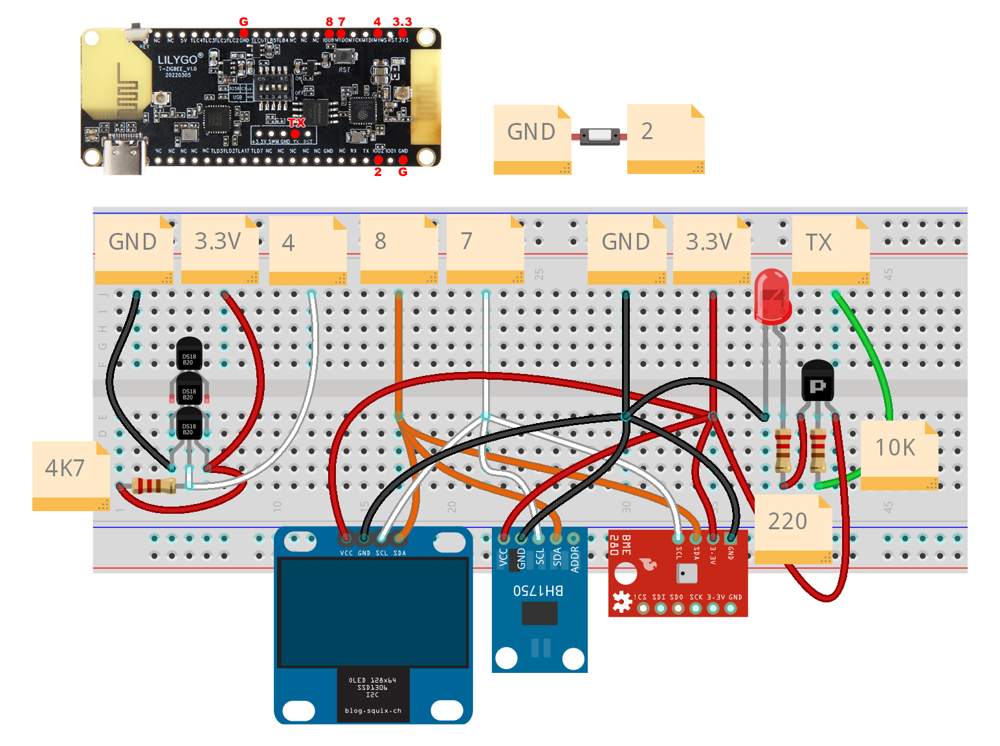
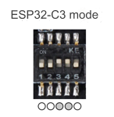
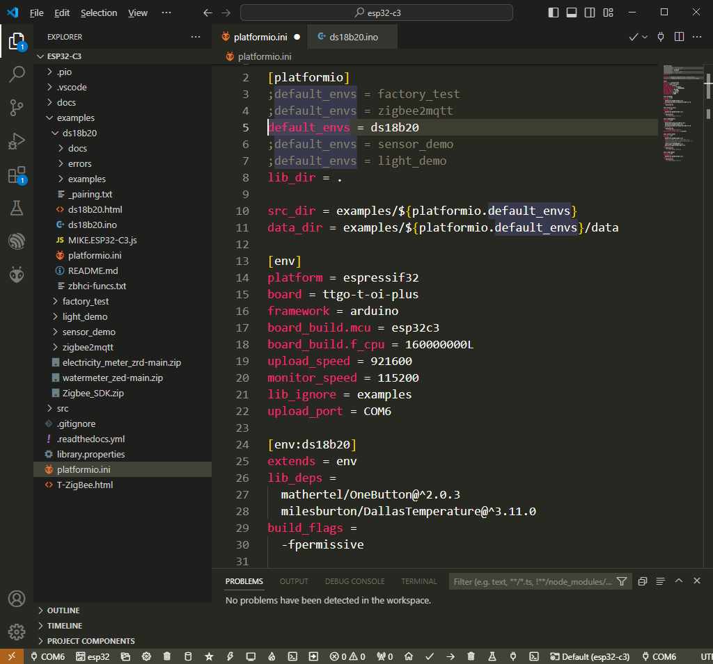
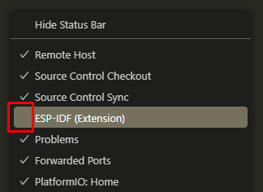
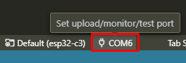
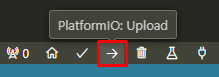
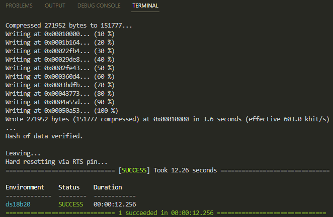
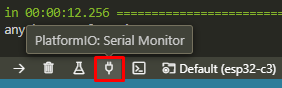
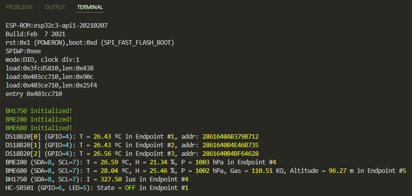
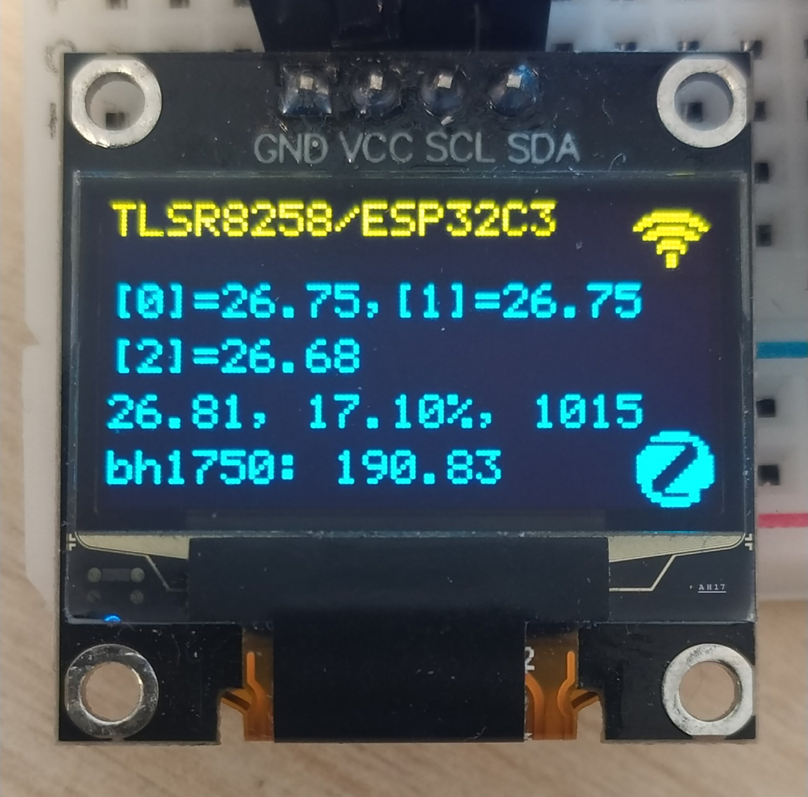

URL: https://github.com/mozolin/LilyGo_T-Zigbee_ESP32C3  
  
# Example: DS18B20 & BME280 & BH1750 sensors with LilyGo T-Zigbee ESP32C3 (Platformio IDE)
  
Zigbe2MQTT Settings:  
[Example: Zigbee2MQTT CC2538 settings for ESP32-C3, ESP32-C6 and CC2530](https://github.com/mozolin/Zigbee2MQTT_CC2538)  
  
  
  

# Make firmware for ESP32-C3 LilyGo T-Zigbee 
Before firmware update, adjust the DIP switch:  

  
1) Install Platformio IDE as VSCode extension (https://platformio.org/install/ide?install=vscode)  

2) Disable ESP-IDF status bar icons  

3) Set the correct COM-port for upload and serial monitor  

4) Build and upload firmware  

5) The result might look like this  

6) Open serial monitor  

7) The result might look like this  

  
  
